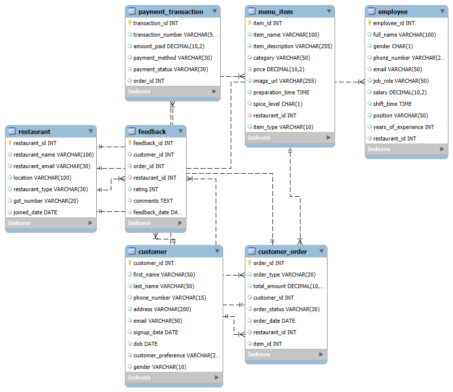

# Restaurant DB Project

This is a **Restaurant Management System Database** project. It includes the database schema, ER diagram, and SQL queries for common operations and tasks.  

---

## Project Overview

This project demonstrates a mini restaurant management system using **MySQL**. It includes:

- **Database Tables** – for customers, orders, employees, menu items, payments, and feedback.
- **ER Diagram** – showing relationships between tables.
- **SQL Queries** – solutions to common database tasks like inserting data, updating records, joining tables, and generating reports.

---

## Tables Included

- `customer` – Stores customer details for orders and feedback.  
- `customer_order` – Tracks all customer orders and links them with payments.  
- `employee` – Contains information about restaurant staff.  
- `feedback` – Records customer ratings and comments.  
- `menu_item` – Catalog of food and drink items available for order.  
- `payment_transaction` – Tracks payment details for orders.  
- `restaurant` – Stores general information about the restaurant.  

---

## ER Diagram

The ER diagram visually represents the relationships between all the tables.  

---

## SQL Queries Solved

I have solved **30 SQL queries** related to this database, including:

- Adding or modifying columns
- Constraints (unique, check, default)
- Inserting, updating, and deleting records
- Joining tables to fetch combined data
- Aggregation queries like total revenue and menu item counts
- Creating views and using insert-select statements

All queries are available in the file: [`restaurant_sql_queries.sql`](restaurant_sql_queries.sql)

---

## How to Use

1. Create the database in MySQL.  
2. Run the table creation scripts in the `tables/` folder.  
3. Optionally, insert sample data using `sample_data.sql`.  
4. Execute the queries in `restaurant_sql_queries.sql` to test the tasks.  

---

This project demonstrates **SQL proficiency** and understanding of **relational database design** in a practical scenario.
